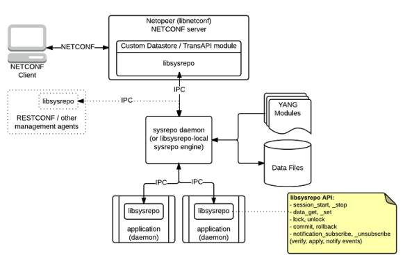

## Sysrepo
Sysrepo is an [YANG](http://tools.ietf.org/html/rfc6020)-based configuration and operational state data store for Unix/Linux applications.

Applications can use sysrepo to store their configuration modeled by provided YANG model instead of using e.g. flat configuration files. Sysrepo will ensure data consistency of the data stored in the datastore and enforce data constraints defined by YANG model. Applications can currently use [C language API](inc/sysrepo.h) of sysrepo Client Library to access the configuration in the datastore, but the support for other programming languages is planed for later too (since sysrepo uses [Google Protocol Buffers](https://developers.google.com/protocol-buffers/) as the interface between the datastore and client library, writing of a native client library for any programing language that supports GPB is possible).

Sysrepo can be easily integrated with management agents such as [NETCONF](https://tools.ietf.org/html/rfc6241) or [RESTCONF](https://tools.ietf.org/html/rfc8040) servers, using the same client library API that applications use to access their configuration. As of now, sysrepo is integrated with the [Netopeer 2 NETCONF server](https://github.com/CESNET/Netopeer2). This means that applications that use sysrepo to store their configuration can automatically benefit from the ability to being controlled via NETCONF.

## Features
-	ability to store / retrieve YANG-modeled data elements adressed by XPath
-	startup, running and candidate datastore support
-	data consistency and constraints enforecment according to YANG models
-	no single point of failure design (does not require any daemon to be running)
-	full transaction and concurrency support
-	notifications of subscribed applications about the changes made in the datastore
-	commit verifiers (change verification by subscribed applications)
-	operational data support (publishing of application's state data to sysrepo)
-	plugins infrastructure for loosely-coupled integration with sysrepo
-	YANG 1.1 support
-	custom RPC, Event Notifications, YANG 1.1 Actions support
-	Python 2 & 3, Java bindigs
-	notification store & notification replay
-	NACM (NETCONF Access Control Model) - disabled by default
-	(TODO) confirmed commit support
-	(TODO) native client libraries / plugins for other programming languages (Python, Java, ...)

## Status
- September 2017: sysrepo [version 0.7.1](https://github.com/sysrepo/sysrepo/releases/tag/v0.7.1) released with many bugfixes and optimizations
- August 2017: sysrepo [version 0.7.0](https://github.com/sysrepo/sysrepo/releases/tag/v0.7.0) released with several important improvements and changes: full NACM support, (X)Paths for subscriptions unified, candidate datastore changes, `sr_commit` functionality change and many bugfixes and enhancements
- May 2017: sysrepo [version 0.6.0](https://github.com/sysrepo/sysrepo/releases/tag/v0.6.0) realeased with many bugfixes and improvements including event notification replay.
- November 2016: sysrepo [version 0.5.0](https://github.com/sysrepo/sysrepo/releases/tag/v0.5.0) realeased with many bugfixes and some minor improvements.
- October 2016: sysrepo [version 0.4.0](https://github.com/sysrepo/sysrepo/releases/tag/v0.4.0) realeased with lots of new features such as: operational data support, commit verifiers, YANG 1.1 support, subtree-based data retrieval or RPC / event notifications support.
- July 2016: new features added into the [devel branch](https://github.com/sysrepo/sysrepo/tree/devel): experimental operational data support and event notifications support
- June 2016: new subscription API & changeset retrieval functionality ready, sysrepocfg tool, released as sysrepo [version 0.3.0](https://github.com/sysrepo/sysrepo/releases/tag/v0.3.0)
- May 2016: RPC support and sysrepo plugins infrastructure ready, working on new subscription API & changeset retrieval functionality
- April 2016: full concurrency and locking support ready, generated Python bindings, integrated with [Netopeer 2 NETCONF server](https://github.com/CESNET/Netopeer2), released as sysrepo [version 0.2.0](https://github.com/sysrepo/sysrepo/releases/tag/v0.2.0)
- March 2016: syrepo daemon and data manipulation (edit-config) functionality ready, working on full concurrency and locking support
- February 2016: working on sysrepo daemon, data manipulation (edit-config) functionality
- January 2016: data retrieval (get-config) functionality ready, released as sysrepo [version 0.1.0](https://github.com/sysrepo/sysrepo/releases/tag/v0.1.0)
- December 2015: implementation started - building internal infrastructure, data retrieval (get-config) functionality

## Performance
According to our measurements using the [performance unit-test](tests/perf_test.c) and [concurrency unit-test](tests/concurr_test.c), sysrepo is able to handle more than 100 000 of requests per second (100 requests per millisecond) by concurrent access and about a half of it by sequential access on a conventional laptop hardware. According to the [API performance testing](http://www.sysrepo.org/sysrepo-performance), an application is able to retrieve more that 1 000 000 data nodes per second from sysrepo, and set / update up to 50 000 data nodes per second in sysrepo.

## Build & Installation Steps
See [INSTALL.md](INSTALL.md) file, which contains detailed build and installation steps.

## Usage Examples
See [examples](examples) directory, which contains an example per each data-acess API function.

Also see our [fork of dnsmasq](https://github.com/sysrepo/dnsmasq-sysrepo) that uses sysrepo to store its configuration for short demonstration of how sysrepo can be integrated into an existing application ([see the diff](https://github.com/sysrepo/dnsmasq-sysrepo/compare/a92c41eda58624056242f0c3a71c1efb7bba91b5...master)).

## Documentation
Client Library API, as well as all internal modules of sysrepo are documented with Doxygen comments. To read the documentation, you can navigate to the [nigthly build of documentation on sysrepo.org](http://www.sysrepo.org/static/doc/html/), or [build your own copy](INSTALL.md) of the documentation.

## Contact
For bug reports, please open an issue on GitHub. For general questions and feedback, please post to our [mailing lists](http://lists.sysrepo.org/listinfo/). You are also welcome to subscribe to our mailing lists if you have interest in sysrepo:
- sysrepo-devel@sysrepo.org - if you want to be involved in all technical discussions
- sysrepo-announce@sysrepo.org - if you want to be informed about new releases and released features

## Other Resources
- [sysrepo.org](http://www.sysrepo.org/) - General information about the project
- CESNET's [Netopeer 2](https://github.com/CESNET/Netopeer2) NETCONF Toolset
- CESNET's [libyang](https://github.com/cesnet/libyang) YANG toolkit
- [RFC 6020](http://tools.ietf.org/html/rfc6020) (YANG Data Modeling Language)
- [RFC 6241](https://tools.ietf.org/html/rfc6241) (Network Configuration Protocol - NETCONF)
